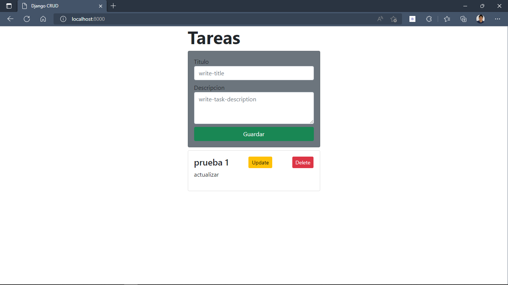
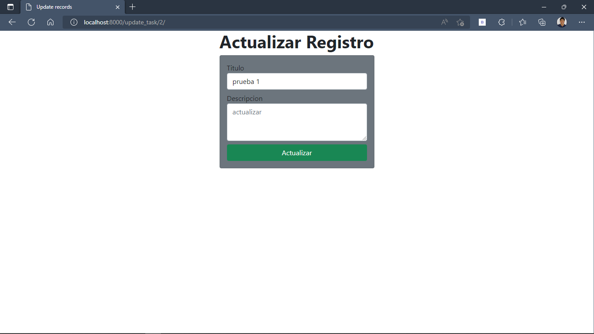
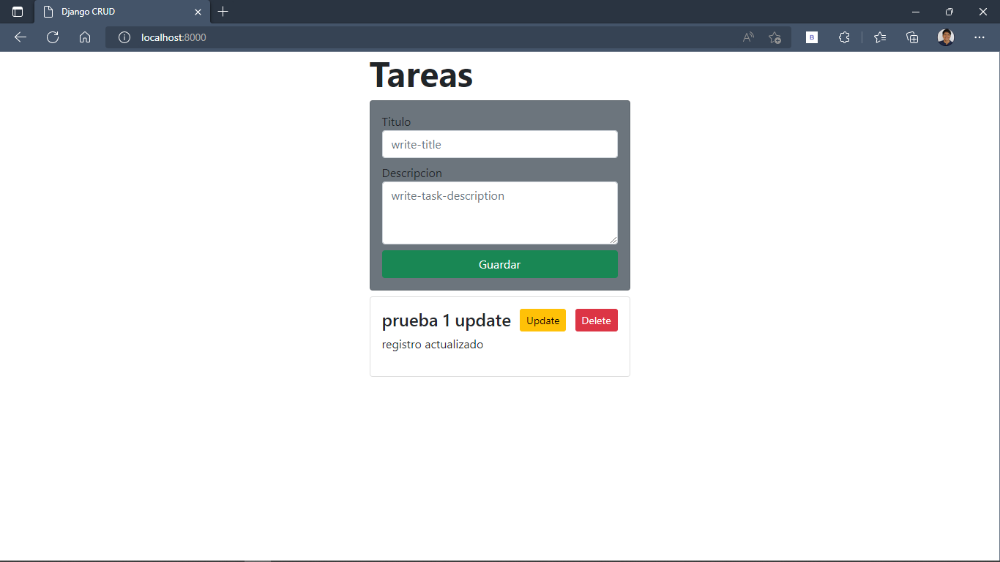
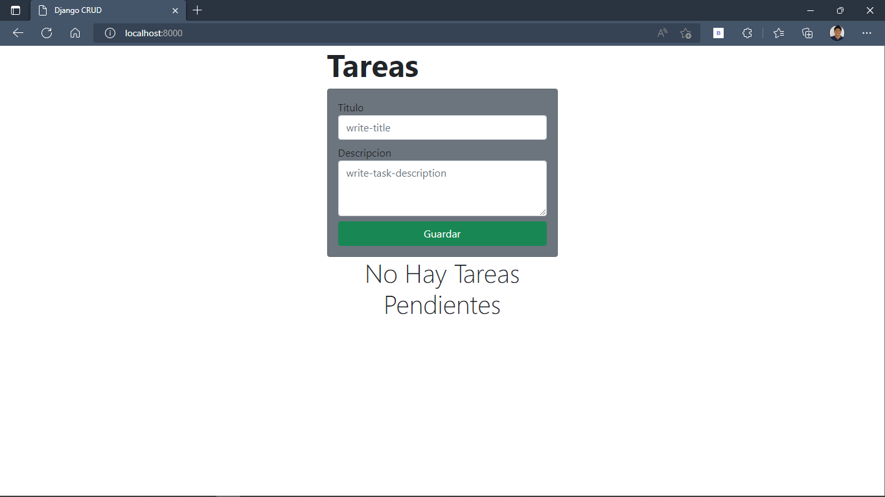
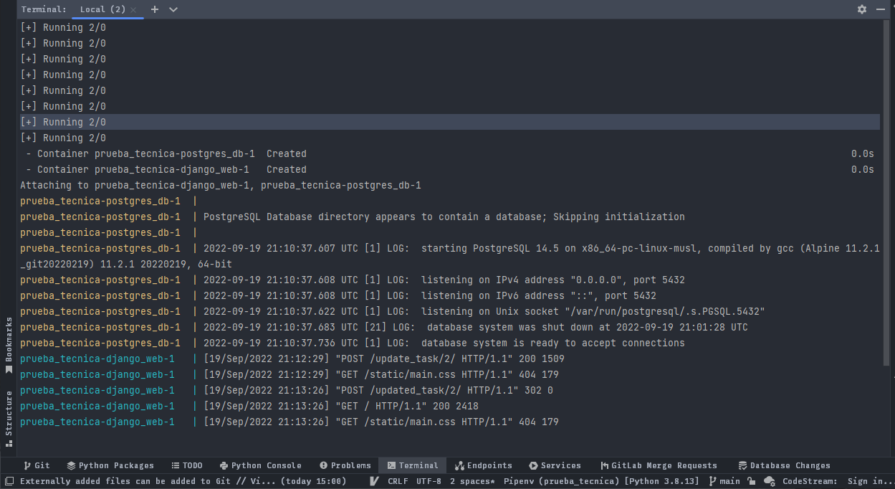

# Prueba tecnica CRUD DJANGO FRAMEWORK
En el siguiente repositorio se muestra una aplicacion de tareas
se implementan las siguientes tecnologias
- ## Docker
  - para la creacion de los containers
- ## Docker-compose
  - para la orquestacion de la base de datos mas la aplicacion
- ## PostgreSQL
  - Sistema de gestion de base de datos escogida para guardar los datos obtenidos del usuario
- ## Django
  - framework de trabajo asignado para esta prueba
- ## Git
  - Tecnologia usada para llevar el control de las versiones del codigo
- ## GitHub
    - Repositorio remoto utilizado para guardar el historial de git
- ## Archivo .env
  - Para almacenar las credenciales y configuraciones se utilizo un archivo de configuracion con variables de entorno
- ## Bootstrap
  - Framework frontend para dar los estilos y colores a la interfaz de usuario 

## Capturas de la aplicacion funcionando desde containers de Docker

